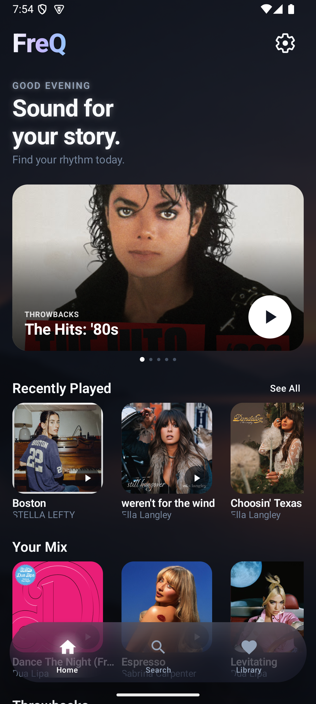

# FreQ

Unlock the full potential of music: stream effortlessly with one app!

[](https://github.com/soumalyajoardar/FreQ/stargazers) [](https://github.com/soumalyajoardar/FreQ/forks) [](https://github.com/soumalyajoardar/FreQ/releases) [](https://github.com/soumalyajoardar/FreQ/blob/main/LICENSE)

---

## Features

Online song, artist & lyrics search with voice input
On-device InnerTube reads with backend fallback — no accounts, no tracking
Vibe-aware autoplay (same artist, language, trending) with seed-artist rescue
Audio flavors: Normal, SnR (0.8x slowed + reverb), Nightcore (1.2x)
Tap-to-flip lyrics card (LRCLIB, on-device)
Browse categories + trending rails
Local library: likes, playlists, follows, recents (on-device DataStore)
Live speaker / headphones / Bluetooth output chip
Time-of-day backgrounds with liquid-glass UI
No ads
No subscriptions

---

## Screenshots

| [](screenshot.png) | [](screenshot2.png) |
| --- | --- |

---

## Download

Get the latest universal APK (all ABIs, signed, installs immediately) from
[GitHub Releases](https://github.com/soumalyajoardar/FreQ/releases/latest).

Or build it yourself:

```powershell
# Debug APK
./gradlew :app:assembleDebug
# → app/build/outputs/apk/debug/app-debug.apk

# Release APK
./gradlew :app:assembleRelease
# → app/build/outputs/apk/release/app-release.apk
```

Release signing defaults to your local debug keystore. For a production key, add to `local.properties` (gitignored, never commit it):

```properties
wave.storeFile=C:\\keys\\freq-release.keystore
wave.storePassword=...
wave.keyAlias=freq
wave.keyPassword=...
```

Run unit tests with `./gradlew :app:testDebugUnitTest`.

---

## Project layout

| Path | What |
|---|---|
| `app/` | Android app (Kotlin, Compose Material3, Media3/ExoPlayer, Haze + Prismal glass) |
| `app/src/main/res/font/` | Bundled Inter typeface |
| `backend/` | Node/Express YTMusic API (reference deployment, not required by the app) |
| `backend-python/` | FastAPI/ytmusicapi backend alternative |

---

## Contributors

Special thanks to all contributors for their time and effort.

[](https://github.com/soumalyajoardar/FreQ/graphs/contributors)

---

## Contribute

Contributions are always welcome. Open an issue first for big changes so we can agree on direction.

---

## F.A.Q

**Does FreQ need an account?**
No. Everything (likes, playlists, history, settings) lives in on-device storage.

**Where does the music come from?**
YouTube Music, read straight from the device via InnerTube with a backend fallback. No audio is hosted in this repo.

**Why is my queue off-vibe?**
If the backend serves a generic list, the app discards it and builds locally — check `adb logcat | Select-String "Autoplay"` to see which path fired.

---

## Credits

[Musify](https://github.com/gokadzev/Musify) — original inspiration for the concept and name. FreQ is independently implemented (native Android/Kotlin) with its own design and branding.

---

## License

```
Copyright © 2026 Soumalya Joardar

FreQ is free software licensed under GPL v3.0. You may use, modify, and distribute
this software freely, but must keep the source code open and publicly available, retain
all copyright notices, disclose all changes made, and use the same GPL v3.0 license.
```

See the [GNU General Public License](https://github.com/soumalyajoardar/FreQ/blob/main/LICENSE) for full details.

---

## Disclaimer

```
FreQ and its contributors do not host, own, or distribute any copyrighted audio content.
The app provides access to content through on-device extractors and external sources.
All trademarks, songs, audio files, and related content remain the property of their
respective owners. Users are solely responsible for ensuring their use complies with
local laws and content-provider terms. The developers assume no liability for misuse.
```
